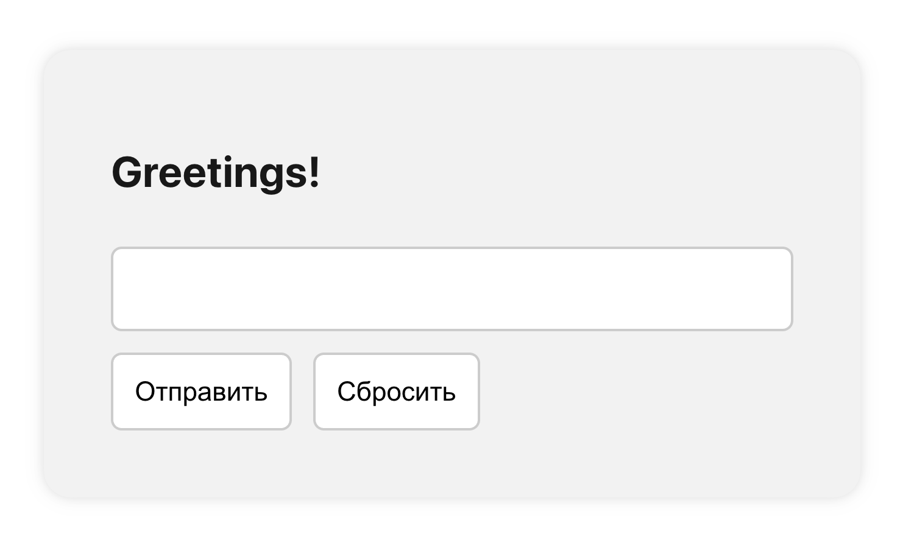

# ТЗ приложение “Greetings!”

**Необходимо создать приложение, выводящее пользовательский текст в заголовок.**

**Функциональные требования:**

1. Пользователь должен иметь возможность вводить произвольный текст.

2. Пользователь должен иметь возможность отправлять значение.

3. Пользователь должен иметь возможность очищать заголовок до значения по умолчанию.

4. Значение заголовка никогда не должно быть пустым.

